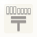

#  郵便番号住所入力プラグイン

郵便番号から都道府県、市区町村、町域を自動で入力するプラグインです。  
都道府県には「文字列（1行）」「ドロップダウン」項目が指定できます。  
郵便番号に対して複数の町域が存在する場合、選択ダイアログから住所を選択します。

## プラグインの読み込み
1. 設定メニュー[kintoneシステム管理]をクリックします。
1. [その他]-[プラグイン]をクリックします。
1. [読み込む]ボタンをクリックすると[プラグインの読み込み]ダイアログが開きます。
1. ダウンロードしたzipファイルを選択し、[読み込む]ボタンをクリックします。

## プラグインの設定
1. プラグインを適用するアプリの[アプリの設定]画面を開きます。
1. [設定]タブの[カスタマイズ／サービス連携]-[プラグイン]をクリックします。
1. 「郵便番号住所入力プラグイン」の[設定]アイコンをクリックします。
1. プラグインの設定画面で項目を設定し（詳細は下記参照）[保存]ボタンをクリックします。
1. [アプリの設定]画面の[アプリを更新]ボタンをクリックします。

## 試用版から製品版への移行
試用版は初回設定から`14日間`使用できます。  
設定画面に表示されている「製品版はこちら」リンクから製品版を購入できます。
1. 試用版のプラグインは`削除せず`に、製品版のzipファイルを上記手順で読み込みます。
1. 試用版の設定情報が引き継がれます。

## 郵便番号住所入力プラグインの設定
各行に「郵便番号」「都道府県」「住所(市区町村)」「住所(町域)」の組み合わせを設定します。  

### 指定可能項目
| 郵便番号 | 都道府県 | 住所(市区町村) | 住所(町域) |
| :------------: |:------------:| :------------:| :------------:|
| 文字列（1行） | 文字列（1行） | 文字列（1行） | 文字列（1行） |
| 数値 | ドロップダウン | - | - |  
  
- 「都道府県」に「ドロップダウン」を指定する場合、項目に47都道府県が設定されている必要があります。  

### 入力必須項目
「郵便番号」  
「住所(市区町村)」  
  
- 「都道府県」が指定されていない場合、「住所(市区町村)」に都道府県と市区町村を合わせて表示します。
- 「住所(町域)」が指定されていない場合、「住所(市区町村)」に市区町村と町域を合わせて表示します。
- 「都道府県」と「住所(町域)」が指定されていない場合、「住所(市区町村)」に都道府県と市区町村と町域を合わせて表示します。

## 追加画面・編集画面

「郵便番号」を入力して確定すると、設定した「都道府県」「住所(市区町村)」「住所(町域)」項目に住所が入力されます。  
  
「郵便番号」が「文字列（1行）」の場合、「-」(ハイフン)あり、なしどちらも入力可能です。

### 郵便番号に対して複数の町域が存在する場合
「郵便番号」を入力して確定すると、住所選択ダイアログが表示されます。  
該当する住所を選択し[選択]ボタンをクリックすると、「都道府県」「住所(市区町村)」「住所(町域)」項目に住所が入力されます。